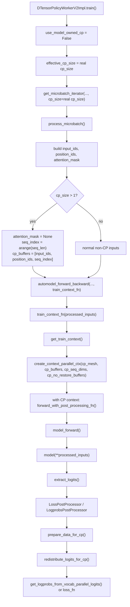
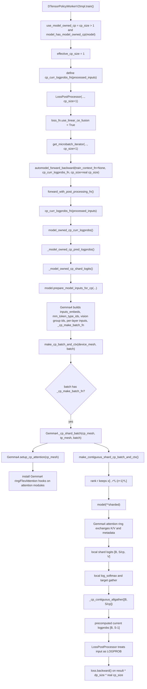
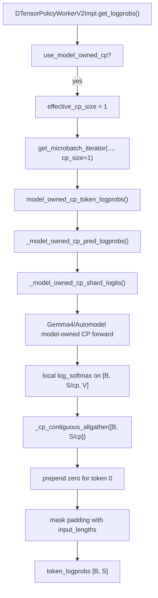

# Gemma4 Model-Owned Context Parallel Flow

This note explains the logical function invocation flow for context parallelism
(CP) in NeMo RL when using Automodel, with focus on why Gemma4 needs a
model-owned CP path instead of the generic SDPA or Transformer Engine (TE) CP
path.

## Mental Model

Context parallelism splits the sequence dimension across CP ranks. The training
loop still reasons about the full logical sequence, but each rank only runs a
local sequence shard. The attention backend is responsible for making remote
key/value information visible to the local query shard.

At a high level, every CP implementation must satisfy this contract:

```text
full logical [B, S] input
  -> sequence-sharded model forward
  -> local shard logits or logprobs
  -> loss/logprob code maps results back to the full logical sequence
```

Generic SDPA CP, generic TE CP, and Gemma4 model-owned CP all follow this
logical contract. They differ in who shards the batch, who wires the attention
communication, and what layout is used for sequence shards.

## Generic CP Flow

The generic path is used for models whose attention can run through the normal
SDPA or TE CP machinery. NeMo RL does not need model-specific CP code here.



Function responsibilities:

| Layer | Functions | Responsibility |
| --- | --- | --- |
| NeMo RL worker | `DTensorPolicyWorkerV2Impl.train`, `get_logprobs` | Select the generic path, build iterators, create post-processors, call forward/backward. |
| NeMo RL data | `process_microbatch` | Build `input_ids`, `position_ids`, and `cp_buffers` for generic CP. |
| NeMo RL context | `get_train_context` | Build and enter `create_context_parallel_ctx` around the model forward. |
| Automodel / torch CP | `create_context_parallel_ctx` | Shard/restore CP buffers and make SDPA see CP-sharded query/key/value tensors. |
| NeMo RL post-processing | `prepare_data_for_cp`, `redistribute_logits_for_cp`, `get_logprobs_from_vocab_parallel_logits` | Convert data and logits into DTensor placements and compute loss/logprobs. |

For SDPA CP, the generic CP context and SDPA hooks handle remote key/value
visibility. For TE CP, Automodel configures TE attention modules with the CP
group, for example through `DotProductAttention.set_context_parallel_group(...)`.
TE then owns the CP communication inside `DotProductAttention`.

The common interface works because NeMo RL only needs a logical sequence-sharded
forward and a way to post-process local outputs. The attention kernel details
are behind the SDPA or TE backend.

## Gemma4 Model-Owned CP Flow

Gemma4 cannot use the generic torch CP SDPA path for the long-context dense E2B
setup. Its CP behavior is owned by the model implementation in Automodel:
Gemma4 prepares full-sequence embeddings, keeps contiguous sequence shards, and
installs its own ring/FlexAttention path for key/value exchange and masking.

NeMo RL therefore bypasses the generic CP context and asks Gemma4/Automodel to
produce CP-sharded logits. NeMo RL then computes only the current-policy
logprobs needed by RL loss.



Function responsibilities:

| Layer | Functions | Responsibility |
| --- | --- | --- |
| NeMo RL worker | `DTensorPolicyWorkerV2Impl.train` | Detect model-owned CP, set `effective_cp_size=1`, skip generic CP context, pass `cp_curr_logprobs_fn` into forward/backward. |
| NeMo RL bridge | `model_owned_cp_curr_logprobs`, `_model_owned_cp_pred_logprobs`, `_model_owned_cp_shard_logits` | Call the model-owned CP prep/forward path, compute next-token logprobs from local shard logits, gather only cheap logprob tensors. |
| Automodel generic dispatch | `make_cp_batch_and_ctx` | Detect `_cp_make_batch_fn` on the batch and delegate CP batch handling back to the model. |
| Gemma4 model | `prepare_model_inputs_for_cp` | Embed the full sequence before CP sharding and attach Gemma4-specific metadata plus `_cp_make_batch_fn`. |
| Gemma4 model | `_cp_shard_batch`, `setup_cp_attention` | Install model-owned CP attention and call the contiguous batch sharder. |
| Gemma4 CP batch | `make_contiguous_shard_cp_batch_and_ctx` | Pad sequence tensors and keep a rank-ordered contiguous sequence slice per CP rank. |
| Gemma4 CP attention | `attach_gemma4_cp_ring_attention`, ring attention helpers | Implement Gemma4-specific K/V ring exchange, mask handling, packed sequence metadata, and vision metadata handling. |

## Logprob Path

The model-owned path has a separate no-grad logprob flow used by policy logprob
queries. It shares the same CP forward core but returns token logprobs directly.



This avoids materializing full logits of shape `[B, S, V]` on every rank. For
long context, that is the main reason this path exists.

## Why NeMo RL Needs Extra Code

The model-owned CP support in NeMo RL is not implementing Gemma4 attention.
Automodel/Gemma4 does that. The extra NeMo RL code is needed to adapt Gemma4's
model-owned CP forward to NeMo RL's RL loss and logprob interfaces.

Key reasons:

- Generic NeMo RL CP assumes torch CP's sharding and restore layout. Gemma4 uses
  rank-ordered contiguous sequence shards, so NeMo RL needs
  `_ContiguousCPAllGather` instead of `allgather_cp_sharded_tensor`.
- RL loss needs next-token current-policy logprobs. Gathering full logits
  `[B, S, V]` would erase the memory benefit of CP at 32k/64k context, so NeMo
  RL computes logprobs locally on `[B, S/cp, V]` and gathers only `[B, S]`.
- Gemma4 pre-embeds the full sequence through `prepare_model_inputs_for_cp`.
  That direct embedding call happens outside the normal top-level FSDP forward
  hooks, so NeMo RL temporarily unshards FSDP modules for the prep step and
  reshards them before the real model forward.
- Gemma4 dense E2B/E4B uses shared KV state. NeMo RL injects Automodel's
  FSDP-safe shared KV store for Gemma4 so FSDP input casting does not copy a
  plain dict per layer.
- Existing loss plumbing expects either logits or a specific logprob path. The
  current integration marks `loss_fn.use_linear_ce_fusion = True` so
  `LossInputType.LOGPROB` treats the tensor as precomputed logprobs.
- Backward scaling still needs the real CP size. Even though the iterator and
  postprocessor run with `effective_cp_size=1`, `automodel_forward_backward`
  receives the real `cp_size` so `loss = result * dp_size * cp_size` cancels the
  FSDP averaging over the flattened DP/CP group.

## Difference From Existing Generic CP Support

| Aspect | Generic SDPA/TE CP | Gemma4 model-owned CP |
| --- | --- | --- |
| CP selection | NeMo RL uses normal CP when `cp_size > 1`. | NeMo RL detects `prepare_model_inputs_for_cp` and switches to model-owned path. |
| Microbatch CP size | Real `cp_size`. | `effective_cp_size=1` to avoid generic CP buffer/context handling. |
| Batch sharding | `create_context_parallel_ctx` or TE batch conversion handles sharding. | Gemma4's `_cp_make_batch_fn` handles contiguous sharding. |
| Attention communication | SDPA CP hooks or TE `DotProductAttention`. | Gemma4 ring/FlexAttention implementation. |
| Sequence layout | Generic torch CP layout, including load-balanced/zigzag assumptions. | Rank-ordered contiguous slices. |
| Logits handling | Postprocessor can redistribute logits through DTensor CP/TP placements. | NeMo RL avoids full logits and gathers only per-token logprobs. |
| Model-specific code in NeMo RL | Minimal. | Bridge code for model-owned forward, logprob computation, contiguous gather, FSDP prep, and loss adaptation. |

## Future Model-Specific CP Support

The current design is a useful foundation for future model-specific CP support,
but it is only partially generic.

The Automodel handoff point is generic:

```text
model.prepare_model_inputs_for_cp()
  -> returns batch additions
  -> may attach _cp_make_batch_fn

make_cp_batch_and_ctx()
  -> sees _cp_make_batch_fn
  -> delegates CP sharding back to the model
```

This means a future model can own its CP batch sharding and attention algorithm
inside Automodel without forcing NeMo RL to know the internal attention details.
That is the right abstraction boundary for model-specific CP.

The current NeMo RL bridge, however, is still mostly a Gemma4-shaped adapter. It
assumes:

```text
local logits shape: [B, S/cp, V]
sequence layout: rank-ordered contiguous shard
rank r owns: input_ids[:, r*L : (r+1)*L]
gather: plain rank-order all_gather + cat
targets: full input_ids[:, seq_start+1 : seq_start+1+L]
```

Those assumptions appear in the logprob path:

```text
local_seq_len = shard_logits.shape[1]
seq_start = cp_rank * local_seq_len
targets = full_ids[:, seq_start + 1 : seq_start + 1 + local_seq_len]
_cp_contiguous_allgather(...)
```

So the current path naturally adapts to future models only when they share the
same basic layout and semantics:

```text
causal LM
text-only RL input
local logits as [B, local_seq, vocab]
rank-ordered contiguous sequence shards
same next-token target semantics
same differentiable contiguous gather behavior
```

Models with contiguous model-owned CP, such as a DeepSeek-V4-style
implementation, may be close to this shape. Models with packed or THD-specific
layouts, such as GLM DSA-style CP, would need a different logprob/gather
adapter. Multimodal models such as Qwen, Nemotron-Omni, or Step3p7 are another
important distinction: they may expose `prepare_model_inputs_for_cp` only to
perform full-sequence multimodal pre-embedding before generic CP. That does not
necessarily mean they own CP attention and sharding in the Gemma4 sense.

The weakest part of the current design is therefore the capability detector:

```python
return hasattr(model, "prepare_model_inputs_for_cp")
```

That conflates two different capabilities:

```text
prepare inputs before generic CP
```

and:

```text
the model owns CP sharding and attention
```

For future support, NeMo RL should use an explicit model-owned CP contract
instead of inferring it from `prepare_model_inputs_for_cp`. For example:

```python
model.supports_nemorl_model_owned_cp = True
model.nemorl_model_owned_cp_layout = "contiguous_bsh"
```

or a small adapter interface:

```python
adapter = get_model_owned_cp_adapter(model)

adapter.prepare_batch(...)
adapter.shard_logits(...)
adapter.local_target_ids(...)
adapter.gather_logprobs(...)
adapter.extra_forward_kwargs(...)
```

That would let NeMo RL support multiple layouts explicitly:

```text
contiguous_bsh -> current Gemma4-style path
packed_thd     -> packed/THD model-owned CP path
custom         -> model adapter computes or gathers logprobs itself
```

The summary is:

```text
Automodel dispatch design:
  reasonably generic

NeMo RL Gemma4 bridge:
  generic only for Gemma4-like contiguous causal LM CP

Recommended future direction:
  add explicit capability detection and layout-specific adapters before using
  this path broadly for arbitrary model-specific CP implementations
```

The division of labor is therefore:

```text
Automodel/Gemma4 owns:
  - CP-aware model input preparation
  - CP batch sharding layout
  - Gemma4-specific attention communication and masks
  - K/V ring behavior and model metadata

NeMo RL owns:
  - choosing generic CP vs model-owned CP
  - integrating the model-owned forward into RL train/logprob APIs
  - avoiding full [B, S, V] logits for long context
  - preserving gradient behavior and loss normalization
```
