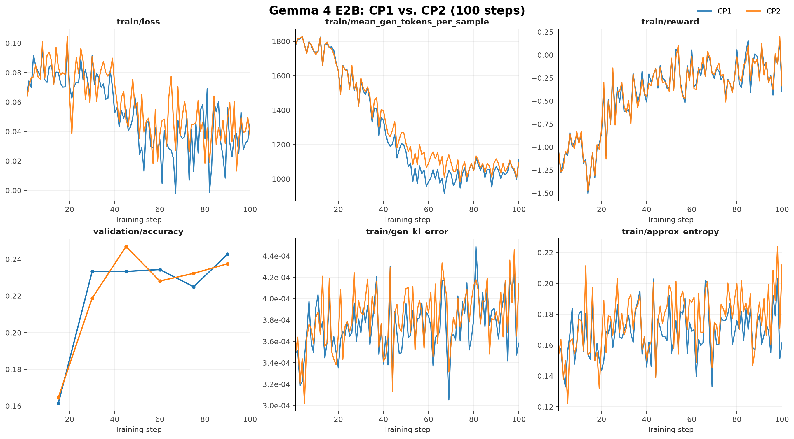
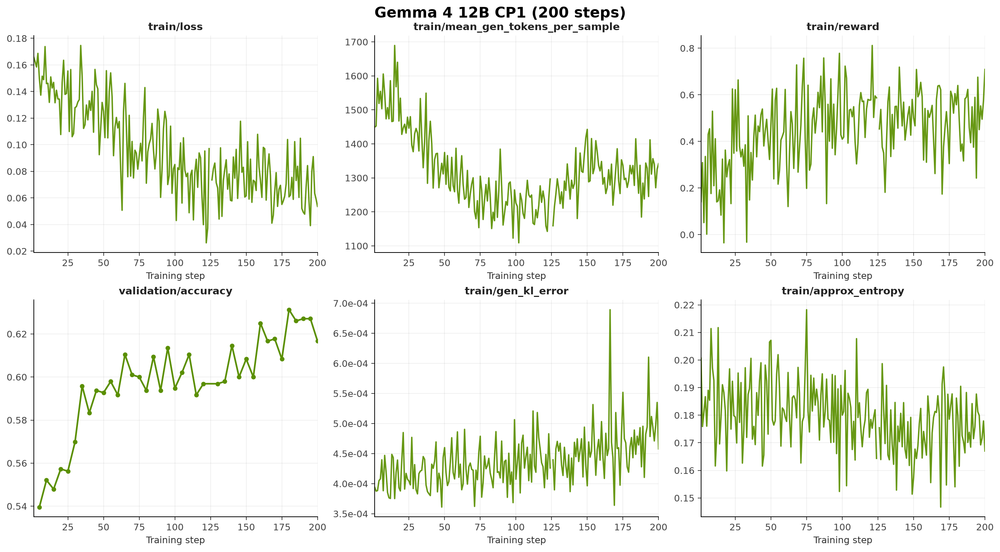

# Gemma 4

NeMo RL supports post-training the Gemma 4 family with the AutoModel training
backend and vLLM generation. The reference configurations cover text-only DAPO
for the E2B, 12B, 26B-A4B, and 31B variants and multimodal GRPO for the E4B
variant.

> [!IMPORTANT]
> **Status: Functionally Ready.** The listed configurations provide short-run
> functional and CI coverage. They are starting points for post-training, not a
> claim of long-run convergence on every model and parallel layout.

## Support Matrix

| Model | Task | Training backend | Training parallelism | Generation backend | Status |
| --- | --- | --- | --- | --- | --- |
| `google/gemma-4-E2B-it` | Text-only DAPO | AutoModel (FSDP2) | CP1 or CP2 | vLLM | Functionally Ready |
| `google/gemma-4-E4B-it` | VLM GRPO | AutoModel (FSDP2) | CP1 | vLLM TP4 | Functionally Ready |
| `google/gemma-4-12B-it` | Text-only DAPO | AutoModel (FSDP2) | CP1 | vLLM TP2 | Functionally Ready |
| `google/gemma-4-26B-A4B-it` | Text-only DAPO | AutoModel (FSDP2) | EP32 with CP1 or CP2 | vLLM TP4 | Functionally Ready |
| `google/gemma-4-31B-it` | Text-only DAPO | AutoModel (FSDP2) | CP1 or CP2 | vLLM TP4 | Functionally Ready |

## Reference Recipes

Recipe YAML files under `examples/configs/recipes/` are the source of truth.

| Model | Layout | Nodes and GPUs | Recipe |
| --- | --- | --- | --- |
| E2B | FSDP2, CP1 | 1n8g | [`dapo-gemma4-e2b-it-1n8g-fsdp2-automodel.yaml`](../../../../examples/configs/recipes/llm/dapo-gemma4-e2b-it-1n8g-fsdp2-automodel.yaml) |
| E2B | FSDP2, CP2 | 1n8g | [`dapo-gemma4-e2b-it-1n8g-fsdp2cp2-automodel.yaml`](../../../../examples/configs/recipes/llm/dapo-gemma4-e2b-it-1n8g-fsdp2cp2-automodel.yaml) |
| E4B | VLM FSDP2, CP1 | 1n8g | [`vlm_grpo-gemma4-e4b-geo3k-1n8g-automodel.yaml`](../../../../examples/configs/recipes/vlm/vlm_grpo-gemma4-e4b-geo3k-1n8g-automodel.yaml) |
| 12B | FSDP2, CP1 | 2n8g | [`dapo-gemma4-12b-it-2n8g-fsdp2-automodel.yaml`](../../../../examples/configs/recipes/llm/dapo-gemma4-12b-it-2n8g-fsdp2-automodel.yaml) |
| 26B-A4B | FSDP2, EP32, CP1 | 4n8g | [`dapo-gemma4-26ba4b-it-4n8g-fsdp2-automodel.yaml`](../../../../examples/configs/recipes/llm/dapo-gemma4-26ba4b-it-4n8g-fsdp2-automodel.yaml) |
| 26B-A4B | FSDP2, EP32, CP2 | 8n8g | [`dapo-gemma4-26ba4b-it-8n8g-fsdp2ep32cp2-automodel.yaml`](../../../../examples/configs/recipes/llm/dapo-gemma4-26ba4b-it-8n8g-fsdp2ep32cp2-automodel.yaml) |
| 31B | FSDP2, CP1 | 4n8g | [`dapo-gemma4-31b-it-4n8g-fsdp2-automodel.yaml`](../../../../examples/configs/recipes/llm/dapo-gemma4-31b-it-4n8g-fsdp2-automodel.yaml) |
| 31B | FSDP2, CP2 | 4n8g | [`dapo-gemma4-31b-it-4n8g-fsdp2cp2-automodel.yaml`](../../../../examples/configs/recipes/llm/dapo-gemma4-31b-it-4n8g-fsdp2cp2-automodel.yaml) |

## Run a Recipe

From an allocation matching the recipe, launch the standard GRPO entry point.
For example, run the 12B configuration with:

```bash
uv run examples/run_grpo.py \
  --config examples/configs/recipes/llm/dapo-gemma4-12b-it-2n8g-fsdp2-automodel.yaml
```

See the [GRPO guide](../../grpo.md) for algorithm and launch details.

## Context Parallel

Context Parallel support uses the refactored AutoModel CP interface introduced
by [PR #3498](https://github.com/NVIDIA-NeMo/RL/pull/3498). The CP2 recipes are
thin overrides of their CP1 parents: the model, optimizer, sequence length, and
generation settings remain identical while
`policy.dtensor_cfg.context_parallel_size` changes to `2`.

Context Parallel currently applies to the text-only E2B, 26B-A4B, and 31B
recipes backed by AutoModel's Gemma 4 model-owned attention. Do not enable it
for the E4B VLM recipe or the 12B unified checkpoint. The text-only recipes
freeze the vision and audio towers, disable sequence packing, and configure
vLLM with `language_model_only: true` where the checkpoint requires it.

Training and generation parallelism are independent. CP partitions training
sequences; the `tensor_parallel_size` under `policy.generation.vllm_cfg`
controls vLLM. The AutoModel model-parallel product must divide the training
world size. In particular, the 26B-A4B CP2 recipe keeps EP32, so EP32 × CP2
requires 64 GPUs and the recipe uses 8 nodes with 8 GPUs per node.

## Validation Curves

The following plots show the raw step-level metrics retrieved from the
[`nv-welcome/nemo-rl-gemma4`](https://wandb.ai/nv-welcome/nemo-rl-gemma4)
Weights & Biases project. Validation accuracy is plotted only at validation
steps; the other metrics are plotted at every recorded training step.

### E2B Context Parallel Parity

The E2B CP1 and CP2 runs use the same 100-step training configuration except
for `policy.dtensor_cfg.context_parallel_size`. Their trajectories remain close
across the six metrics: the mean absolute difference in validation accuracy is
0.0083 across six aligned validation points, while the mean absolute difference
in generation KL error is 1.6e-5 across 100 aligned training points.



See the W&B runs for [CP1](https://wandb.ai/nv-welcome/nemo-rl-gemma4/runs/e2c1a830)
and [CP2](https://wandb.ai/nv-welcome/nemo-rl-gemma4/runs/e2c2a830).

### 12B Long Run

The 12B CP1 run completed 200 steps. Validation accuracy increases from 0.540
at step 5 to 0.617 at step 200 and reaches a maximum of 0.631. Training loss
decreases from 0.166 at step 1 to 0.054 at step 200, while generation KL error
stays below 6.9e-4. W&B contains 199 training-metric rows and 39 validation
rows; step 125 has no values for the requested metrics, so the plot does not
interpolate that missing row.



See the [12B CP1 W&B run](https://wandb.ai/nv-welcome/nemo-rl-gemma4/runs/g412b200).

## 12B Unified Checkpoint

The 12B checkpoint reports `model_type: gemma4_unified` and architecture
`Gemma4UnifiedForConditionalGeneration`. NeMo RL routes it through the
image-text AutoModel class so the complete checkpoint can load, while the
reference recipe trains only the language path:

- The vision and audio towers are frozen.
- vLLM generation uses `language_model_only: true` and TP2.
- Weight refits omit the frozen vision/audio tensors because vLLM's text-only
  unified model uses encoder-free multimodal stubs with a different layout.
- vLLM tokenizer initialization is enabled for the unified architecture.
- Activation checkpointing and optimizer offload during log-probability
  computation are enabled.
- Sequence packing and Liger kernels are disabled.
- The total sequence length is 4,096 tokens, with up to 3,072 generated tokens.

## Limitations and Tracking

- Context Parallel is not supported by the Gemma 4 VLM recipe.
- The 12B `gemma4_unified` checkpoint currently supports CP1 only; unlike the
  other text variants, it does not use AutoModel's Gemma 4 model-owned CP
  attention implementation.
- The recipes disable sequence packing; validate any packing change separately.
- The functional status does not imply long-run convergence for every variant.
- Gemma 4 CP support is tracked by
  [#2914](https://github.com/NVIDIA-NeMo/RL/issues/2914), and 12B support by
  [#2913](https://github.com/NVIDIA-NeMo/RL/issues/2913).
