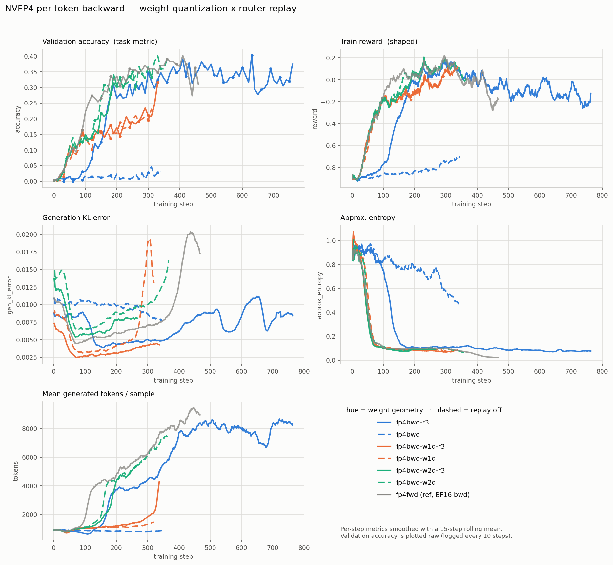

# NVFP4 per-token backward: weight quantization x router replay

Self-contained readout of six training legs plus one reference. Data pulled 2026-07-28
from W&B `nv-welcome/qwen3-30b-nvfp4` via
`research/vllm-nvfp4-pertoken/fetch_bwd_curves.py` (run ids in that script).

**Primary metric is `validation/accuracy`** — DAPOMathAIME2024, 256 samples, evaluated
every 10 steps. `train/reward` is reported as a secondary signal but is *shaped*
(overlong-buffer penalty, rescaling to [-1,1]) and, as F5 shows, understates the
differences between legs. Conclusions are drawn from accuracy.

---

## 1. Experiment design

All legs: Qwen3-30B-A3B-Base, DAPO-512 / 20k response, 8 nodes x 4 GB200, TP2/EP8,
identical data and seed. Real NVFP4 per-token **forward and backward** on the MoE
expert GEMMs (attention and the first-2/last-4 layers stay BF16). Activations and
gradients are quantized identically in every leg: per-token outer scale + 1x16 e4m3
inner blocks. Only the two dials below vary.

**Dial A — weight quantization.** An NVFP4 value is `4-bit code x inner block scale x
outer scale`. For weights, both levels are set independently:

| geometry | outer scale | inner block |
|---|---|---|
| `vector/1x16` | per-row `(M,)` + per-col `(K,)` vectors | 16 elements |
| `scalar/1x16` | one scalar for the whole tensor | 16 elements |
| `scalar/16x16` | one scalar for the whole tensor | 16x16 tile |

They form a chain in which each step changes exactly one thing:

```
vector/1x16  --[outer: vector -> scalar]-->  scalar/1x16  --[inner: 1x16 -> 16x16]-->  scalar/16x16
```

**Dial B — router replay.** Off, or on (vLLM returns its generation-time MoE routing and
the training forward replays it, removing routing nondeterminism between generation and
training).

3 geometries x 2 replay settings = six legs. A seventh run, `fp4fwd`, sits **outside the
factorial as a reference**: same per-token forward, but a dequantized (BF16) backward —
no FP4 backward at all.

---

## 2. Analysis — the curves



*Hue = weight geometry; dashed = router replay off; gray = the BF16-backward reference.
Per-step metrics use a 15-step rolling mean; validation accuracy is raw (logged every
10 steps). Regenerate with `plot_bwd_curves.py`.*

### 2.1 Validation accuracy (primary)

Nearest validation point within +/-15 steps of each mark.

| leg | geometry | replay | 50 | 100 | 150 | 200 | 250 | 300 | 350 | 400 | best |
|---|---|---|---|---|---|---|---|---|---|---|---|
| `fp4bwd` | vector/1x16 | off | 0.012 | 0.020 | 0.012 | 0.023 | 0.012 | 0.027 | 0.031 | — | 0.047 |
| `fp4bwd-r3` | vector/1x16 | ON | 0.016 | 0.031 | 0.125 | 0.266 | 0.273 | 0.348 | 0.328 | 0.355 | **0.402** |
| `fp4bwd-w1d` | scalar/1x16 | off | 0.066 | 0.137 | 0.160 | 0.152 | 0.195 | 0.195 | — | — | 0.230 |
| `fp4bwd-w1d-r3` | scalar/1x16 | ON | 0.113 | 0.133 | 0.156 | 0.172 | 0.188 | 0.211 | — | — | **0.316** |
| `fp4bwd-w2d` | scalar/16x16 | off | 0.113 | 0.137 | 0.270 | 0.301 | 0.352 | **0.367** | 0.359 | — | **0.402** |
| `fp4bwd-w2d-r3` | scalar/16x16 | ON | 0.082 | 0.148 | 0.219 | 0.305 | 0.324 | — | — | — | 0.340 |
| `fp4fwd` *(ref)* | BF16 bwd | off | 0.094 | 0.223 | 0.266 | 0.336 | 0.355 | 0.359 | 0.371 | 0.367 | **0.402** |

Three tiers are visible **at step 300**: ~0.35-0.37 (`w2d`, `fp4fwd`, `fp4bwd-r3`),
~0.20 (`w1d`, `w1d-r3`), and ~0.03 (`fp4bwd`).

The middle tier is not stable. `w1d-r3` went 0.211 @300 -> **0.316 @330** — most of its
gap to the top tier closed in 30 steps, and it is still running. Read the step-300
column as a snapshot of a leg mid-climb, not as its level (F1, F9).

### 2.2 Train reward (secondary, shaped)

| leg | geometry | replay | 50 | 100 | 150 | 200 | 250 | 300 |
|---|---|---|---|---|---|---|---|---|
| `fp4bwd` | vector/1x16 | off | -0.896 | -0.856 | -0.847 | -0.838 | -0.818 | -0.753 |
| `fp4bwd-r3` | vector/1x16 | ON | -0.863 | -0.749 | -0.307 | -0.059 | 0.044 | 0.127 |
| `fp4bwd-w1d` | scalar/1x16 | off | -0.528 | -0.188 | -0.158 | -0.100 | -0.065 | 0.084 |
| `fp4bwd-w1d-r3` | scalar/1x16 | ON | -0.465 | -0.179 | -0.147 | -0.098 | -0.059 | 0.082 |
| `fp4bwd-w2d` | scalar/16x16 | off | -0.484 | -0.202 | -0.033 | 0.050 | 0.061 | 0.148 |
| `fp4bwd-w2d-r3` | scalar/16x16 | ON | -0.474 | -0.202 | -0.128 | 0.067 | 0.061 | — |
| `fp4fwd` *(ref)* | BF16 bwd | off | -0.490 | -0.111 | 0.052 | 0.060 | 0.081 | 0.133 |

### 2.3 Mean generated tokens per sample

`train/mean_gen_tokens_per_sample`, windowed. On AIME the policy has to learn to reason
at length; this is where that shows up.

| leg | ~100 | ~200 | ~300 | ~340 |
|---|---|---|---|---|
| `fp4bwd` | 863 | 824 | 816 | 850 |
| `fp4bwd-r3` | 744 | 3793 | 4268 | 5642 |
| `fp4bwd-w1d` | 1050 | 1100 | 1232 | 1405 |
| `fp4bwd-w1d-r3` | 1037 | 1145 | 1871 | **3510** |
| `fp4bwd-w2d` | 1211 | 4567 | 6098 | 6764 |
| `fp4bwd-w2d-r3` | 1060 | 4524 | 5297 | — |
| `fp4fwd` *(ref)* | 2320 | 4413 | 6320 | 7452 |

### 2.4 Generation KL error

| leg | replay | 50 | 100 | 150 | 200 | 250 | 300 | 350 |
|---|---|---|---|---|---|---|---|---|
| `fp4bwd` | off | 0.0102 | 0.0104 | 0.0100 | 0.0097 | 0.0097 | 0.0084 | 0.0075 |
| `fp4bwd-r3` | ON | 0.0084 | 0.0077 | 0.0039 | 0.0044 | 0.0047 | 0.0049 | 0.0050 |
| `fp4bwd-w1d` | off | 0.0046 | 0.0032 | 0.0035 | 0.0042 | 0.0053 | **0.0181** | — |
| `fp4bwd-w1d-r3` | ON | 0.0031 | 0.0027 | 0.0029 | 0.0031 | 0.0037 | 0.0043 | — |
| `fp4bwd-w2d` | off | 0.0083 | 0.0066 | 0.0074 | 0.0088 | 0.0095 | 0.0103 | **0.0140** |
| `fp4bwd-w2d-r3` | ON | 0.0065 | 0.0058 | 0.0061 | 0.0079 | 0.0081 | — | — |
| `fp4fwd` *(ref)* | off | 0.0056 | 0.0050 | 0.0053 | 0.0059 | 0.0065 | 0.0071 | 0.0080 |

### 2.5 Trajectory shape

Peak of the 25-step rolling mean of reward, and best validation accuracy:

| leg | best val acc | at step | smoothed reward peak | reward decay >0.25 | last step |
|---|---|---|---|---|---|
| `fp4bwd` | 0.047 | 310 | -0.712 (never positive) | not observed | 346, cancelled |
| `fp4bwd-r3` | 0.402 | 630 | +0.148 @305 | step 457 | 763, cancelled |
| `fp4bwd-w1d` | 0.230 | 310 | +0.086 @319 | not observed | 320, cancelled |
| `fp4bwd-w1d-r3` | **0.316** | 330 | +0.080 @306 | not observed | 339, running |
| `fp4bwd-w2d` | 0.402 | 330 | +0.171 @296 | not observed | 367, cancelled |
| `fp4bwd-w2d-r3` | 0.340 | 190 | +0.156 @239 | not observed | 260, running |
| `fp4fwd` *(ref)* | 0.402 | 410 | +0.181 @297 | step 436 | 467, stalled |

---

## 3. Findings

### F1 — The outer scale decides whether the run learns; the inner block decides how fast

Walking the single-dial chain, on accuracy. Both comparisons are single-dial: `fp4bwd`
vs `w1d` share 1x16 inner blocks and differ only in the outer scale; `w1d` vs `w2d` share
the scalar outer and differ only in the inner block.

| geometry | val acc @300 | best so far | reads as |
|---|---|---|---|
| `vector/1x16` (`fp4bwd`) | 0.027 | 0.047 @310 | never learns |
| `scalar/1x16` (`w1d-r3`) | 0.211 | **0.316 @330**, still rising | learns, **late** |
| `scalar/16x16` (`w2d`) | 0.367 | 0.402 @330 | learns, on time |

The two steps are **not** equivalent in kind:

- **Outer scale, vector -> scalar: qualitative.** `vector/1x16` never leaves the
  untrained baseline in 346 steps (F2). This is the difference between learning and not.
- **Inner block, 1x16 -> 16x16: a delay, not a ceiling.** At step 300 the gap looked like
  ~2x (0.195 vs 0.367). But `w1d-r3` then went 0.211 -> 0.316 between steps 300 and 330,
  closing most of it, and has not plateaued. F9 gives the proximate reason: the
  `scalar/1x16` legs are slow to grow their generation length, and accuracy follows
  length.

An earlier revision of this report read the step-300 column as a level and concluded the
inner geometry was worth a permanent ~+0.17. That was a leg caught mid-climb. What the
data supports now is a difference in *rate*; whether the asymptotes differ is not yet
established, because no `scalar/1x16` leg has plateaued.

### F2 — With a vector outer scale, the run does not learn the task at all

`fp4bwd` sits at 0.012-0.031 validation accuracy for its entire 346-step run, peaking at
0.047. That is essentially the untrained baseline (step 0 = 0.004). Its reward improves
from -0.90 to -0.75 over the same span, which reads as slow learning; accuracy shows it
is not learning the task.

### F3 — Router replay rescues a bad quantizer, and does nothing for a good one

| geometry | replay off | replay ON | delta |
|---|---|---|---|
| `vector/1x16` | 0.027 | 0.348 | **+0.321** |
| `scalar/1x16` | 0.195 | 0.211 | +0.016 |
| `scalar/16x16` | 0.367 | 0.324 *(@250; 0.352 vs 0.324 at matched 250)* | ~0 / slightly negative |

The effect of replay is enormous where the weight quantizer is worst, negligible where it
is best. Replay is therefore a **compensating** mechanism, not an independent gain — and
stacking it on a good quantizer buys nothing measurable here.

### F4 — Replay suppresses late train/generation drift

Reading gen_kl rather than accuracy, on the same single-dial pairs:

| leg | 150 | 250 | 300 | 350 |
|---|---|---|---|---|
| `w1d` (off) | 0.0035 | 0.0053 | **0.0181** | — |
| `w1d-r3` (ON) | 0.0029 | 0.0037 | **0.0043** | — |
| `w2d` (off) | 0.0074 | 0.0095 | 0.0103 | **0.0140** |
| `w2d-r3` (ON) | 0.0061 | 0.0081 | — | — |

~4x apart at step 300 with replay as the only dial. Both replay-off legs were cancelled
during this rise. This is a *stability* signal, not a quality one — see F8 for why
gen_kl actively mis-ranks these configurations.

### F5 — Train reward understates the differences; do not rank legs by it

At step 300, `w1d` reward 0.084 vs `w2d` 0.148 — a modest gap that reads as "both work".
Their accuracies at the same step are 0.195 and 0.367, a near-2x difference. Conversely
`fp4bwd`'s reward climbs steadily (-0.90 to -0.75) while its accuracy never leaves the
noise floor.

Reward here is shaped (overlong-buffer penalty, rescale to [-1,1]) and rewards format and
length compliance that accuracy does not. Any conclusion in this campaign drawn from
reward alone should be re-checked against accuracy.

### F6 — Real FP4 per-token backward reaches BF16-backward parity

Best validation accuracy: `fp4fwd` (BF16 backward) **0.402**, `fp4bwd-w2d` (real FP4
backward) **0.402**, `fp4bwd-r3` **0.402**. At step 300, 0.359 vs 0.367 vs 0.348.

The quantized backward costs nothing measurable on this task — *provided* the weight uses
`scalar/16x16`, or replay compensates for a worse geometry.

### F7 — Where decay has been observed, it is not attributable to FP4 backward

Only two legs ran past step 400: `fp4bwd-r3` (to 763) and `fp4fwd` (to 467). Both show a
>0.25 reward decay (steps 457 and 436). On accuracy the picture is gentler — `fp4bwd-r3`
holds 0.29-0.40 out to step 760, and `fp4fwd` falls from 0.402 @410 to 0.309 @460.
`fp4fwd` has no FP4 backward, so a quantized backward is not required to produce this.

Every other leg peaks in the same window (step 190-330) and was stopped shortly after, so
decay is *expected* but not *measured* for them.

### F8 — gen_kl tracks agreement with the ROLLOUT's weight cast, and anti-correlates with accuracy

The vLLM rollout quantizes expert weights at refit with a **per-tensor scalar outer scale
plus 1x16 e4m3 inner blocks** — `weight_scale_2 = amax / (6*448)` per expert, and
`_quantize_blocks` reshaping the last dim into `(k//16, 16)` with `block_scale =
block_amax / 6` (`nemo_rl/models/generation/vllm/quantization/nvfp4_pertoken.py`). TE
computes its per-tensor global scale by the identical formula,
`global_encode_scale = fp8_max * fp4_max / global_amax` = `448*6/amax`
(`common/cast/nvfp4/core_nvfp4.cuh:87`).

That is exactly the `scalar/1x16` geometry. So one training leg quantizes its forward
weight the same way the rollout does, and the others do not:

| leg | training forward (rowwise) weight cast | vs rollout `scalar/1x16` | gen_kl @250 |
|---|---|---|---|
| `w1d` | scalar outer + 1x16 | **matches at both levels** | **0.0053** |
| `w2d` | scalar outer + 16x16 | outer matches, inner differs | 0.0095 |
| `fp4bwd` | per-row `(M,)` outer + 1x16 | inner matches, **outer differs** | 0.0097 |

gen_kl orders exactly by that alignment, with outer-level mismatch costing more than
inner-level — consistent with the outer scale being the coarser of the two.

**The consequence is that gen_kl mis-ranks the legs.** `w1d` has the best
train/generation agreement of any FP4 leg and roughly half the accuracy of `w2d`
(0.195 vs 0.367 at step 300). Minimising gen_kl would have selected the worse
configuration.

*Basis: geometry and scale-formula agreement read from source, not a measured
bit-comparison of the two casts.*

### F9 — Accuracy is downstream of generation length, and the geometries differ mostly in how fast length grows

On AIME the policy has to learn to reason at length. Mean generated tokens per sample:

| leg | ~100 | ~200 | ~300 | ~340 | shape |
|---|---|---|---|---|---|
| `fp4bwd` | 863 | 824 | 816 | 850 | **flat — never grows** |
| `fp4bwd-w1d` | 1050 | 1100 | 1232 | 1405 | near-flat to step 300 |
| `fp4bwd-w1d-r3` | 1037 | 1145 | 1871 | **3510** | flat, then breaks upward ~step 310 |
| `fp4bwd-w2d-r3` | 1060 | 4524 | 5297 | — | grows from ~step 160 |
| `fp4bwd-w2d` | 1211 | 4567 | 6098 | 6764 | grows from ~step 150 |
| `fp4bwd-r3` | 744 | 3793 | 4268 | 5642 | grows from ~step 130 |
| `fp4fwd` *(ref)* | 2320 | 4413 | 6320 | 7452 | grows earliest, ~step 80 |

Accuracy tracks this almost one-for-one. `fp4bwd` never grows and never learns.
`w1d-r3`'s accuracy jump (0.211 -> 0.316 over steps 300-330) coincides exactly with its
length jump (1871 -> 3510). The legs that grow length by step 150 are the legs at
~0.35 accuracy by step 300.

The `approx_entropy` panel shows the same ordering from the other side: every leg except
`fp4bwd` collapses from ~1.0 to ~0.1 within the first ~150 steps, and `fp4bwd` is still
at ~0.5 when it is cancelled — it never commits to a policy. `fp4bwd-r3` collapses
visibly later than the `scalar/*` legs, matching its later length growth.

So the weight geometry's effect on accuracy is mediated: it changes when the policy
starts producing long reasoning chains. That reframes F1's second step as a rate
difference rather than a quality ceiling.

---

## 4. Hypothesis

**H1 — The damage scales with how much the forward and backward weights disagree.**

TE quantizes each weight twice from the same BF16 source: rowwise (consumed by the
forward, `Y = X·W`) and columnwise (consumed by dgrad, `dX = dY·Wᵀ`). If the two do not
agree, the backward computes the gradient of a different function than the forward
evaluated. That disagreement is a fixed function of `W`, so it acts as a systematic bias
rather than noise.

How much they disagree depends on which scale levels are direction-dependent:

| geometry | outer, fwd vs bwd | inner, fwd vs bwd | val acc @300 |
|---|---|---|---|
| `vector/1x16` | **differs** — `(M,)` vs `(K,)` vectors | **differs** — 16 elems along row vs col | 0.027 |
| `scalar/1x16` | identical | **differs** | 0.195 |
| `scalar/16x16` | identical | identical — a 16x16 tile is the same 256 numbers either way | 0.367 |

The accuracy ordering is monotonic in the number of direction-dependent levels, and F1
shows the two levels contribute comparably. This is the cleanest single explanation of
the weight results.

**How to test H1.** Measure the *magnitude* of disagreement, not the fraction of
differing elements: compute `||W_row - W_colᵀ|| / ||W||` per geometry on real checkpoint
weights. H1 predicts `vector/1x16 > scalar/1x16 > scalar/16x16 = 0`, with the first two
gaps comparable in size, mirroring F1. `verify_w1d_weight_legs.py` already performs the
casts and currently reports element-mismatch *fraction* (0.00% for `scalar/16x16`,
~76-77% for `scalar/1x16`); adding a relative-norm metric and a `vector/1x16` case would
settle it on one node.

H1 is consistent with all six legs but is not established by them — the legs vary the
geometry, not the disagreement magnitude directly.

**H2 — Router replay removes a routing-flip channel that a bad weight quantizer
amplifies.**

Replay makes the training forward reuse generation's MoE routing. Its benefit tracks how
bad the quantizer is (F3: +0.321 accuracy for `vector/1x16`, +0.016 for `scalar/1x16`,
~0 for `scalar/16x16`). MoE routing is a top-k over logits, so small numerical
perturbations can reorder it; a weight quantizer whose forward and backward disagree
perturbs exactly those logits. Replay makes the training pass agree with generation by
construction, regardless of how large the perturbation is.

**How to test H2.** Log the per-step fraction of tokens whose top-k expert set differs
between generation and training. H2 predicts this fraction rises with the H1 disagreement
metric across geometries, and tracks gen_kl within a leg.

**H3 — Two independent mismatches pull the weight geometry in opposite directions, and
the gradient one dominates.**

H1 and F8 describe different quantities, and no geometry minimises both:

| mismatch | between | corrupts | minimised by | best leg |
|---|---|---|---|---|
| **train/gen** | training forward cast vs the rollout's cast | gen_kl, importance ratios | matching the rollout's geometry | `scalar/1x16` (F8) |
| **fwd/bwd** | training forward cast vs training backward cast | gradient direction — a systematic bias | transposition invariance | `scalar/16x16` (H1) |

`scalar/1x16` minimises the first at the cost of the second; `scalar/16x16` does the
reverse. Accuracy prefers `scalar/16x16`, so on this task the **gradient** mismatch is
the more costly of the two: computing faithful-to-the-rollout logprobs does not help if
the updates derived from them are biased.

How costly is now less clear than it first appeared. The preference shows up as a
~150-step delay in the onset of generation-length growth (F9) rather than a demonstrated
ceiling — `w1d-r3` closed most of the accuracy gap once its length took off. So H3
should be read as "the fwd/bwd mismatch dominates the *learning dynamics*", not
necessarily the final quality.

This subsumes both earlier hypotheses and explains why the metric that looks like a
train/gen health check (gen_kl) points at the slower configuration.

**How to test H3.** It is already testable with the H1 measurement: if
`||W_row - W_colᵀ|| / ||W||` ranks `scalar/16x16` best while F8's alignment argument ranks
`scalar/1x16` best, and accuracy follows the former, H3 holds as stated. A stronger
version would need a geometry that is *both* rollout-matched and transposition-invariant,
which does not exist in the current TE build — the rollout would have to move to 16x16
inner blocks.

---

## 5. Conclusions

1. **A per-tensor scalar outer scale is mandatory** (F1, F2). `vector/1x16` never leaves
   the untrained baseline in 346 steps. This is the one setting that decides whether the
   run learns at all, and it is not negotiable.

   **16x16 inner tiles are strongly preferred but the evidence is now weaker than it
   looked.** `scalar/16x16` reaches BF16-backward parity fastest and is the safe choice
   today. `scalar/1x16` is markedly slower (F9) but was still climbing when last
   observed (0.316 @330 vs 0.402 best), so a permanent accuracy penalty is **not**
   established.

2. **The inner geometry buys time-to-accuracy, not obviously final accuracy** (F1, F9).
   16x16 tiles cost one scale per 256 elements instead of per 16 — coarser resolution —
   and still get the policy growing its reasoning length ~150 steps sooner. On a fixed
   step budget that is decisive. Whether it changes the ceiling needs a `scalar/1x16` leg
   run to a plateau, which has not happened.

3. **Router replay is not needed once the weight geometry is right** (F3). It is worth
   enabling for late-run stability (F4), but it should not be treated as a substitute for
   fixing the quantizer: `vector/1x16` + replay reaches 0.348 at step 300 versus 0.367
   for `scalar/16x16` with no replay, and the replay path is doing much more work to get
   there.

4. **Real FP4 per-token backward is viable** (F6). With conclusion 1, it matches a BF16
   backward on best accuracy (0.402 vs 0.402). This is the campaign's headline result.

5. **Rank configurations by validation accuracy, not train reward or gen_kl** (F5, F8).
   Both secondary metrics mis-rank legs here. Reward compresses a 2x accuracy gap into a
   small one. gen_kl is worse than uninformative — it measures agreement with the
   rollout's weight cast, which the losing geometry matches exactly, so optimising it
   selects `scalar/1x16` over `scalar/16x16`.

   Note this is not merely "gen_kl is noisy" — it is a real measurement of a real
   quantity that happens to be the wrong objective (H3).

6. **The late decay is the next thing to understand** (F7), but the evidence is currently
   two legs, one of which has no FP4 backward. Running the replay-on legs past step 500
   is the cheapest way to establish whether it is universal.

7. **A rollout-side change is worth considering.** The train/gen and fwd/bwd mismatches
   cannot both be minimised today (H3): the rollout quantizes weights with 1x16 inner
   blocks while the best training geometry uses 16x16. Moving the rollout producer to
   16x16 tiles would align the two without giving up transposition invariance. Untested,
   and gated on what the FlashInfer TRT-LLM MoE kernel will accept.

---

## 6. What this data cannot tell you

1. **Most legs were stopped near their peak.** Only `fp4bwd-r3` (763) and `fp4fwd` (467)
   ran past step 400. `w1d-r3` and `w2d-r3` reached ~320 and ~260. Conclusions about
   long-run behaviour rest on two legs.

2. **`w2d-r3` is the weakest-supported cell.** Best accuracy 0.340 at step 190 with only
   27 validation points; its comparison against `w2d` in F3 uses step 250 for both, where
   they read 0.352 vs 0.324. That gap is within the noise of this metric.

3. **Validation is 256 samples of AIME2024, evaluated every 10 steps.** Step-to-step
   swings of +-0.03 are common (see any leg's trace). Differences below ~0.05 accuracy
   should not be interpreted; the F1 effects (~0.17 each) are well above that floor.

4. **Single seed, single model, single task.** No error bars, no repeats.

5. **`fp4bwd` was stopped at step 346.** The claim is that it does not learn the task in
   346 steps, not that it provably never would.

6. **Both mechanisms in section 4 are hypotheses**, consistent with the curves but not
   demonstrated by them. Each has a stated cheap test.
